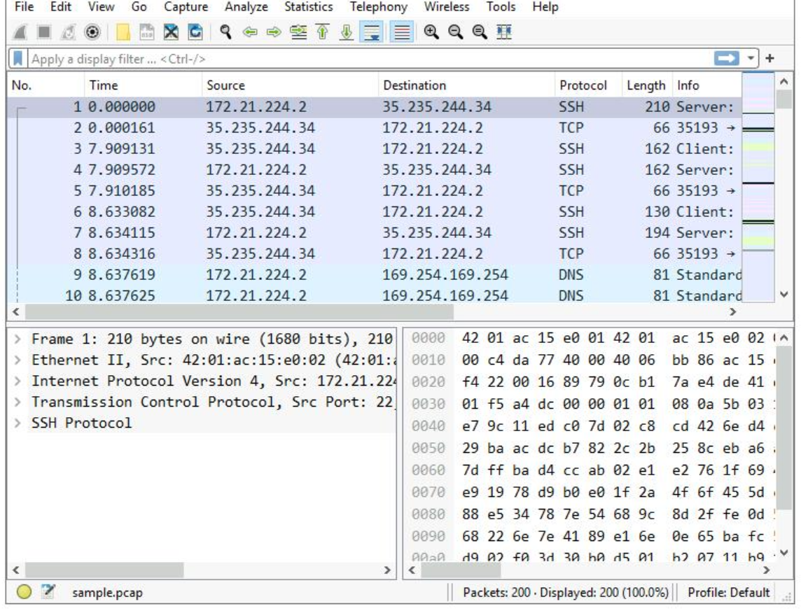
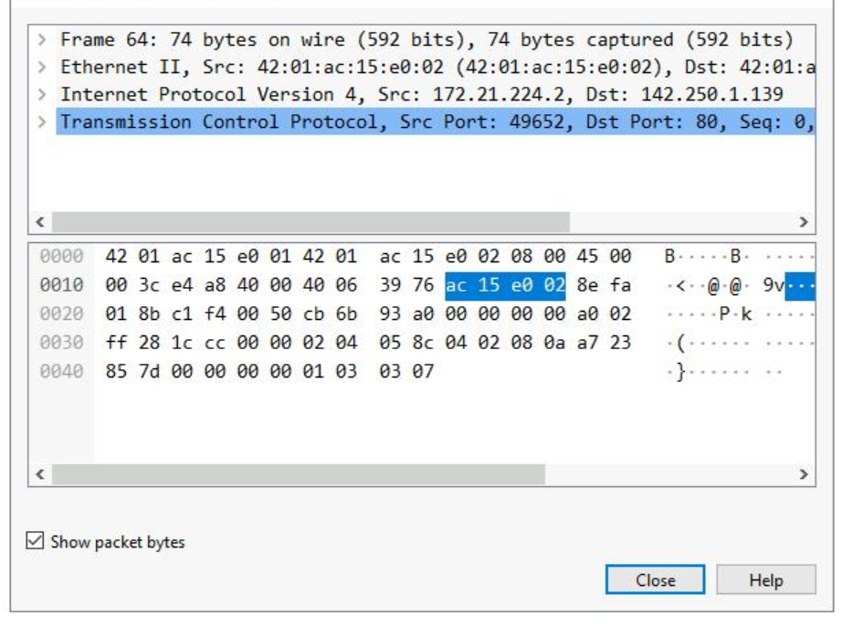

 <h1>Analyze packets with Wrieshark</h1>


<h2>Description</h2>
Utilizing Wireshark to inspect packet data and apply filters to sort through packet information.
<br />


<h2>Utilities Used</h2>

- <b>Wireshark</b> 

<h2>Environments Used </h2>

- <b>Windows 10</b>

<h2>Walk-through:</h2>

<p align="center">
Start by opening Wireshark and performing a scan of the network to capture traffic: <br/>

<br />
<br />
Filter the traffic for traffic related to IP address 142.250.1.139 double click the first protocol that is listed as TCP and view the packet details pane window. In this window we can observe the upper section of the window containing subtrees where Wireshark provides us with an analysis of the various parts of the network packet. The lower section contains raw packet data displayed in hexadecimal and ASCII text:  <br/>

<br />
<br />
Packet sniffers are a valuable tool for cyber security professionals. They can point to problems within a network or show the source IP address for an unknown device. Analyzing and securing network traffic is an essential responsibility for Cyber security analysts. <br/>
<br />
<br />


<!--
 ```diff
- text in red
+ text in green
! text in orange
# text in gray
@@ text in purple (and bold)@@
```
--!>
